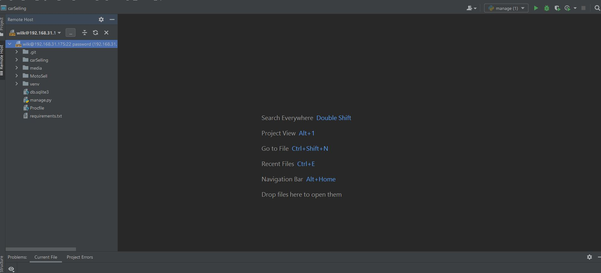
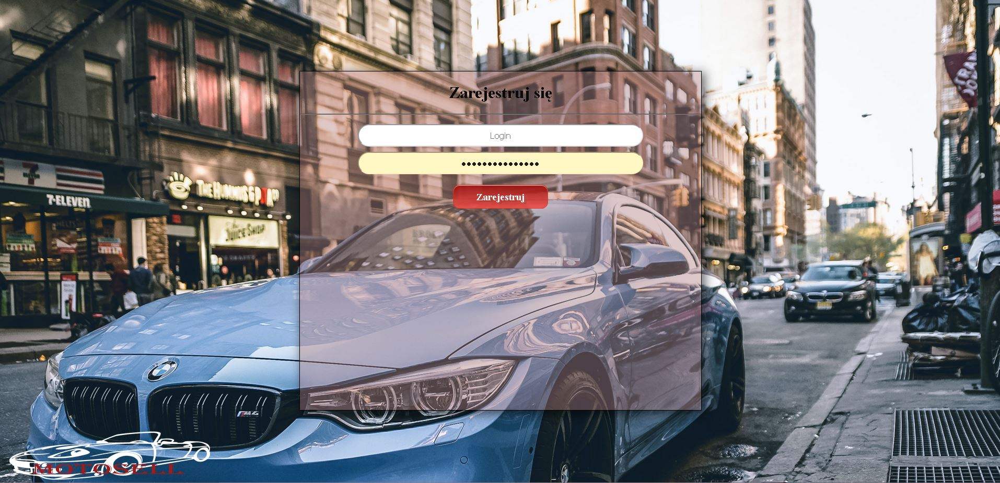
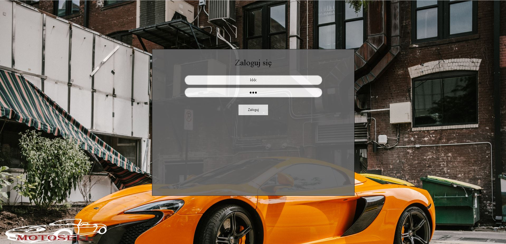
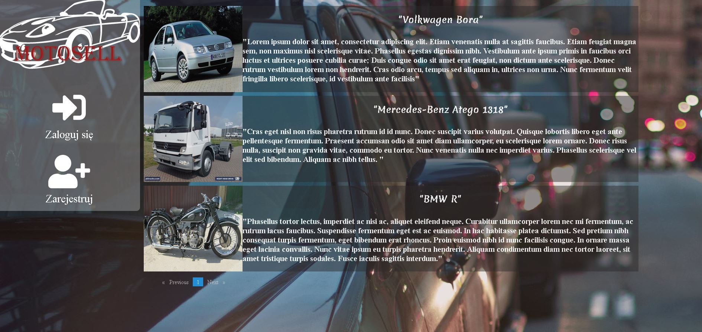
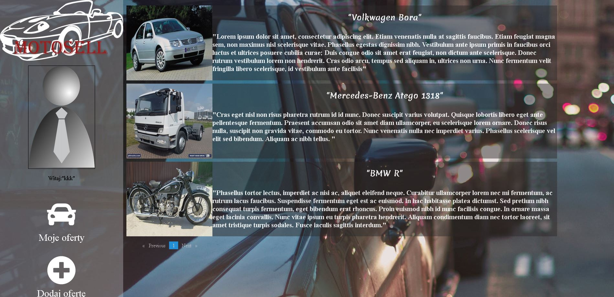
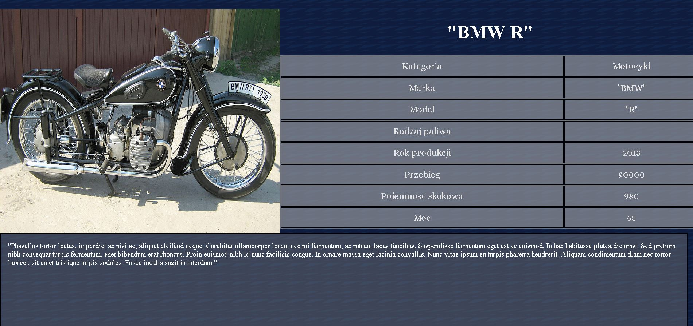
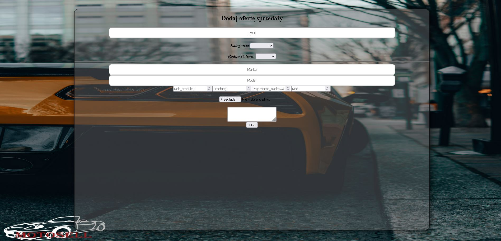
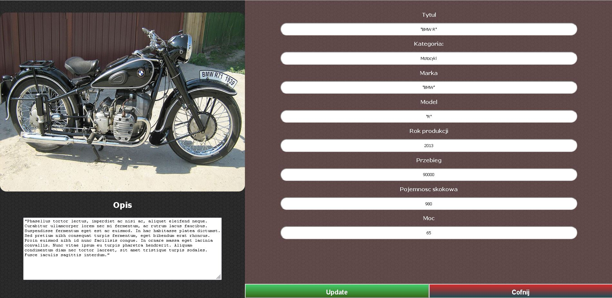

# Motosell

<h2>Zdalny host</h2>

<h2>Rejestracja</h2>

<h2>Logowanie</h2>

<h2>Strona główna</h2>

<h2>Strona główna po zalogowaniu</h2>

<h2>Detale oferty ze strony głównej</h2>

<h2>Dodawanie oferty</h2>

<h2>Oferty użytkownika</h2>

<h2>Aktualizowanie oferty</h2>

<h2>Jak sprawdzić</h2>
otworzyć w kompilatorze i w terminalu napisac "npm i", a następnie ng serve. 
