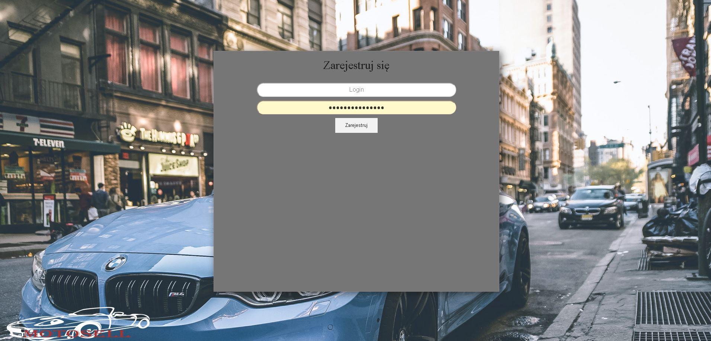
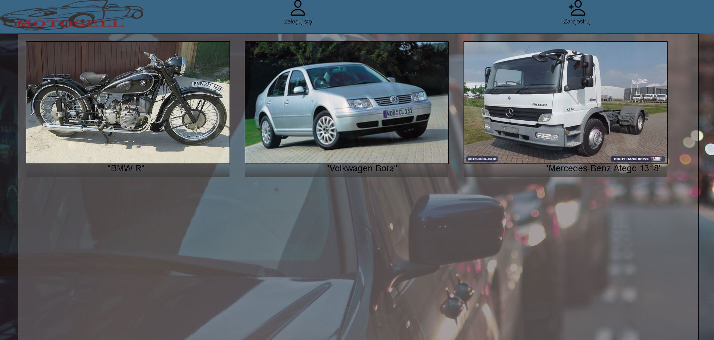
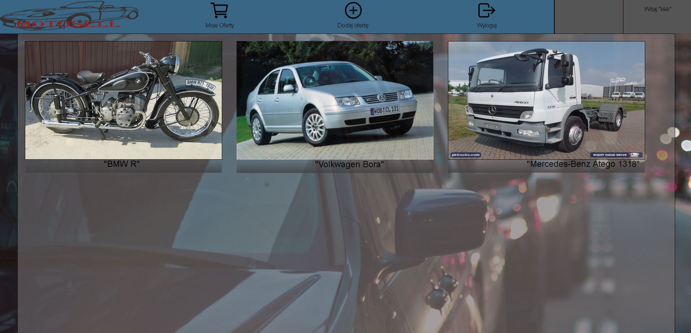
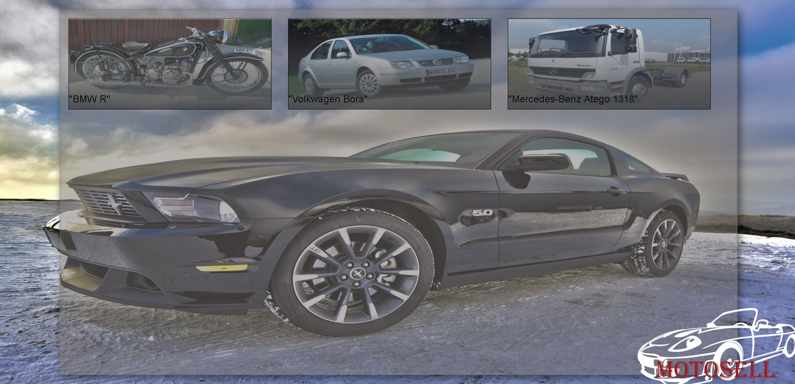

# MotoSell
Sprawdzenie aplikacja:
Po pobraniu kodu Angulara z git'a w kompilatorze wpisujemy npm i, a następnie ngserve

Dokumentacja:
<h3>Remote Host</h3>

<h3> Rejestracja</h3>

<h3> Logowanie</h3>

<h3> Strona główna</h3>

<h3> Strona główna po zalogowaniu </h3>

<h3> Dodawanie oferty</h3>

<h3> Oferty użytkownika</h3>

